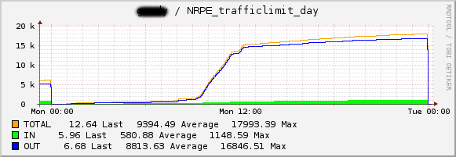
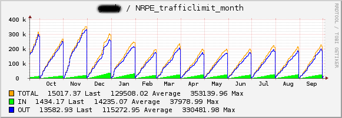

# check_traffic_limit

check_traffic_limit is a Nagios/Icinga2 plugin based on vnstat traffic accounting. It checks traffic on any interface and sends a warning when defined daily or monthly limits are reached.
The plugin comes with a pnp4Nagios grapher templates.

# Installation

* `apt install vnstat`
* `vnstat -u -i eth0`
* `apt install libnagios-plugin-perl`
* `cp check_traffic_limit /usr/local/lib/nagios/plugins/`

# Usage

see `check_traffic_limit --h` for help

```
check_traffic_limit -i interface
                  [-w warning_threshold] [-c critical_threshold]
                  [-p period d|m]
```

* Example:

  `check_traffic_limit -i eth0 -w 10000 -c 12000 -p d`

# Icinga2 configuration

### /etc/nagios/nrpe_local.cfg
```
command[check_traffic_limit]=/usr/local/lib/nagios/plugins/check_traffic_limit -i $ARG1$ -w $ARG2$ -c $ARG3$ -p $ARG4$
```

### /etc/icinga2/conf.d/hosts/servername/nrpe-check-traffic-limit.conf

```
object Service "NRPE trafficlimit: servername - day" {
        import "generic-nrpe-service"
        host_name = "servername"
        check_command = "check_nrpe_1arg"
        vars.nrpe_command = "check_traffic_limit"

        vars.nrpe_args = [ "$interface$", "$warning$", "$critical$", "$period$" ]

        vars.interface = "eth0"
        vars.warning = "20971520"
        vars.critical = "23068672"
        vars.period = "d"
}

object Service "NRPE trafficlimit: servername - month" {
        import "generic-nrpe-service"
        host_name = "servername"
        check_command = "check_nrpe_1arg"
        vars.nrpe_command = "check_traffic_limit"

        vars.nrpe_args = [ "$interface$", "$warning$", "$critical$", "$period$" ]

        vars.interface = "eth0"
        vars.warning = "576716800"
        vars.critical = "597688320"
        vars.period = "m"

	    check_interval = 10m
}
```

/etc/icinga2/conf.d/templates.conf
```
template Service "generic-nrpe-service" {
  import "generic-service"
  check_command = "check_nrpe_1arg"
  vars.pnp_check_arg1 = "!$nrpe_command$"
}
```

/etc/icinga2/conf.d/your_commands.conf
```
object CheckCommand "check_nrpe_1arg" {
        import "plugin-check-command"
        command = [PluginDir + "/check_nrpe" ]
        arguments = {
            "-H" = "$nrpe_host$"
            "-p" = "$nrpe_port$"
            "-c" = "$nrpe_command$"
            "-a" = {
                value = "$nrpe_args$"
                repeat_key = false
                order = 1
            }
            "-t" = "$nrpe_timeout$"
        }

        vars.nrpe_host = "$address$"
        vars.nrpe_port = 5666

```
# Output examples

#### 24h


#### one year


# Feedback

Feel free to contact me on any questions: marcus.schopen@uni-bielefeld.de
